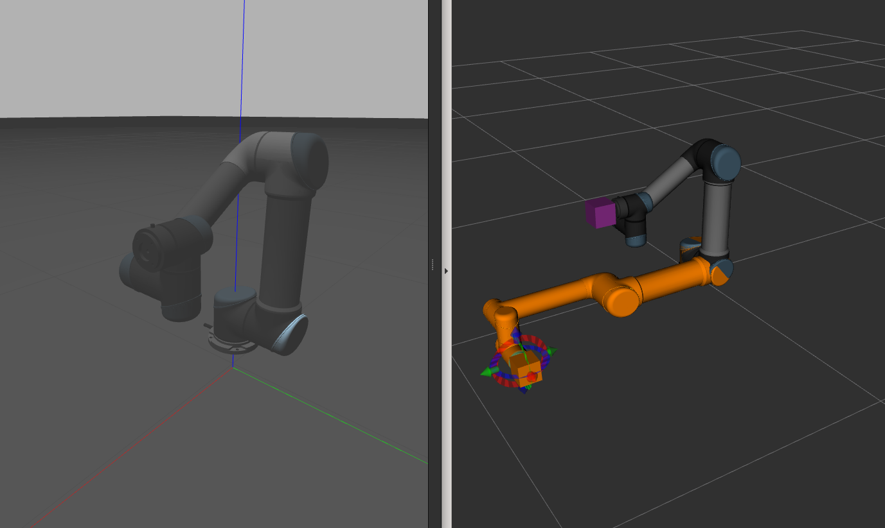
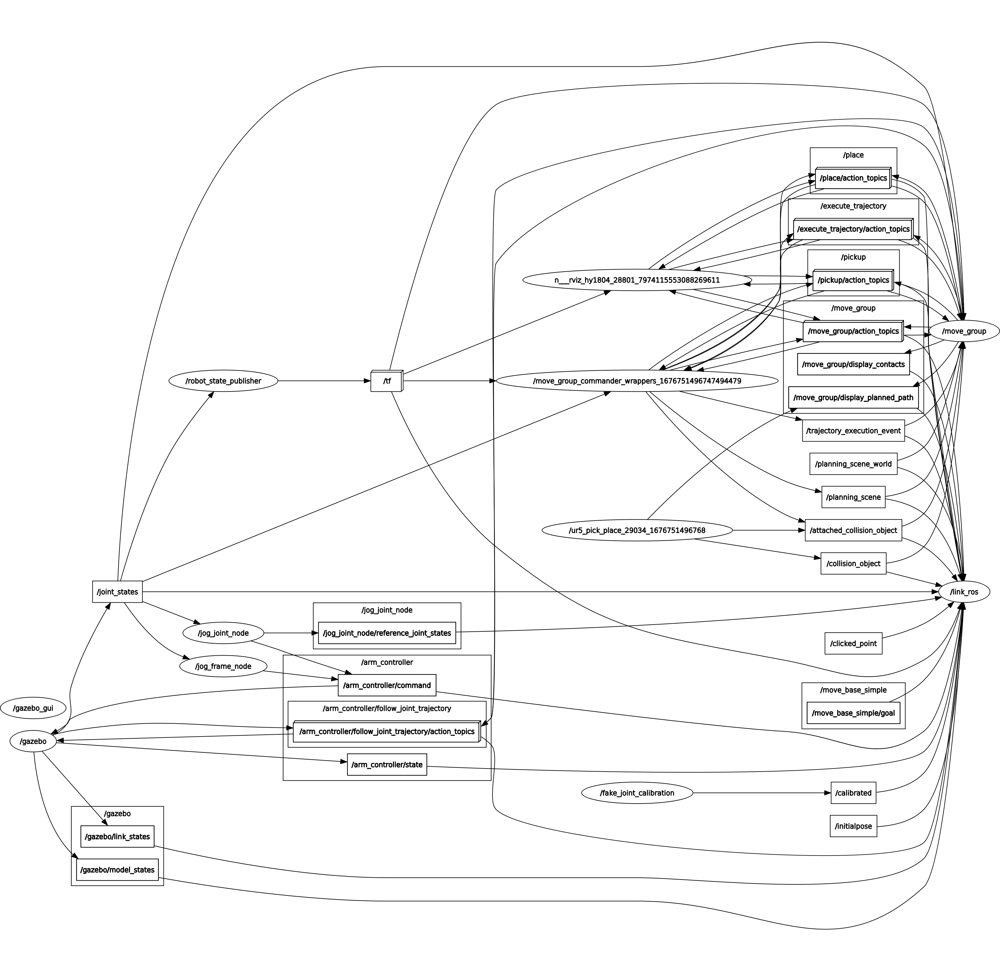

## UR5 Simulation
UR5 simulation environment with MoveIt, Gazebo, programmatic and jog control. Tested on ROS Melodic and Noetic.



<br>

### Run MoveIt
```bash
roslaunch ur5_moveit_config demo.launch 
```

### Run MoveIt with Gazebo
Run commands in seperate terminals.
```bash
roscore
roslaunch ur_gazebo ur5.launch limited:=true
roslaunch ur5_moveit_config ur5_moveit_planning_execution.launch sim:=true limited:=true
roslaunch ur5_moveit_config moveit_rviz.launch config:=true
```

### Run Pick Place Demo
```bash
rosrun ur5_move ur5_pick_place.py
```

### Run Jog Control
0. Run Gazebo.
1. 
    ```bash
    roslaunch jog_launch ur5.launch # use_joy:=true for gamepad
    ```
2. From Rviz, Panels(in menu bar) > Add New Panel > JogFramePanel


-----


#### On code changes:
```bash
cd <workspace>/
source devel/setup.bash
catkin build <packagename>
source devel/setup.bash
```

#### Helpful Resources
- http://docs.ros.org/en/melodic/api/moveit_tutorials/html/doc/move_group_python_interface/move_group_python_interface_tutorial.html
- https://github.com/ros-industrial/universal_robot
- https://github.com/tork-a/jog_control

#### ROS Graph

